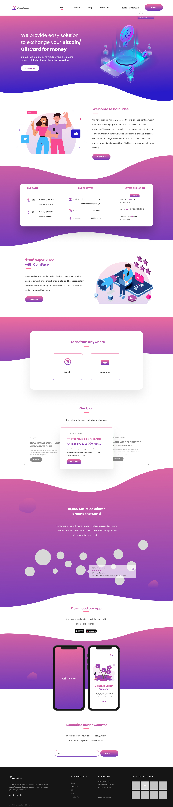

# Многостраничный React Вебсайт - [Cсылка на ДЕМО](https://coinbase-react-app.netlify.app/)

## [Ссылка на Figma Макет][https://www.behance.net/gallery/89965451/coinbase-web-mobile-free-ui-kit/]

## Основные элементы:

- Полностью адаптивный
- Валидация
- Пагинация
- Popup Modal
- Accordion

## Используемые технологии:

1. React:

- React Router
- useParams
- useState
- useEffect
- react-paginate
- styled-components
- swiper
- react-transition-group

2. HTML/CSS

- БЭМ Методология
- SMACSS (Scalable and Modular Architecture for CSS)
- FLEXBOX/CSS Grid
- styled-components

